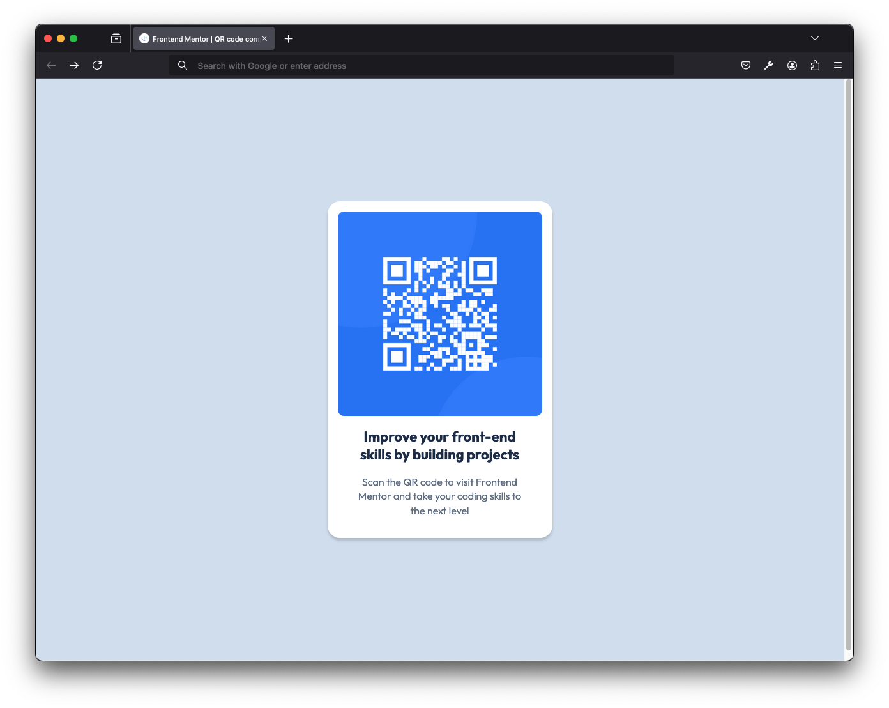

# Frontend Mentor - QR code component solution

This is a solution to the [QR code component challenge on Frontend Mentor](https://www.frontendmentor.io/challenges/qr-code-component-iux_sIO_H). Frontend Mentor challenges help you improve your coding skills by building realistic projects. 

## Table of contents

- [Overview](#overview)
  - [Screenshot](#screenshot)
  - [Links](#links)
- [My process](#my-process)
  - [Built with](#built-with)
  - [What I learned](#what-i-learned)
  - [Continued development](#continued-development)
  - [Useful resources](#useful-resources)
- [Author](#author)

## Overview

### Screenshot

### Links

- Solution URL: [Add solution URL here](https://your-solution-url.com)

## My process

### Built with

- Semantic HTML5 markup
- CSS custom properties
- Flexbox
- Figma pixel-perfect (at least I gave it a shot)

### What I learned

I wanted to give every element a seperate class, but figured it'd be overkill for such a small site.

Since the image is used purely for styling, I've decided not to use figure and figcaption.

### Continued development

- Looking forward to using advanced CSS selectors
- Can't wait to get my hands on some JS again

### Useful resources

- [The Markdown Guide](https://www.markdownguide.org/) - This helped me improve my Markdown skills for writing in this file.

## Author

- Frontend Mentor - [@yourusername](https://www.frontendmentor.io/profile/curi0usmind)